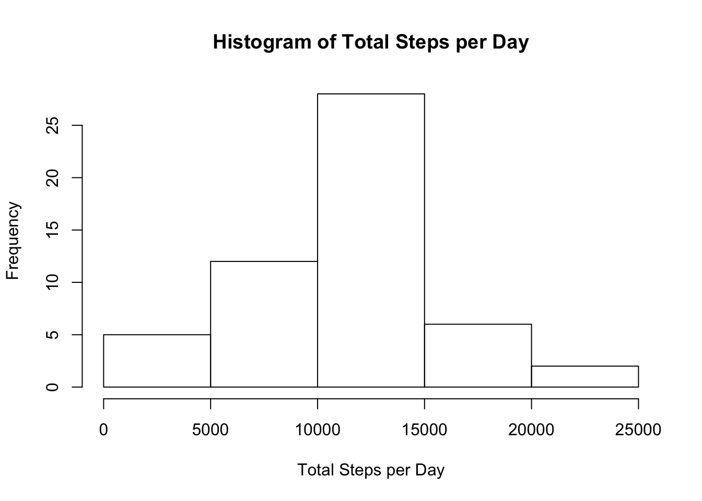
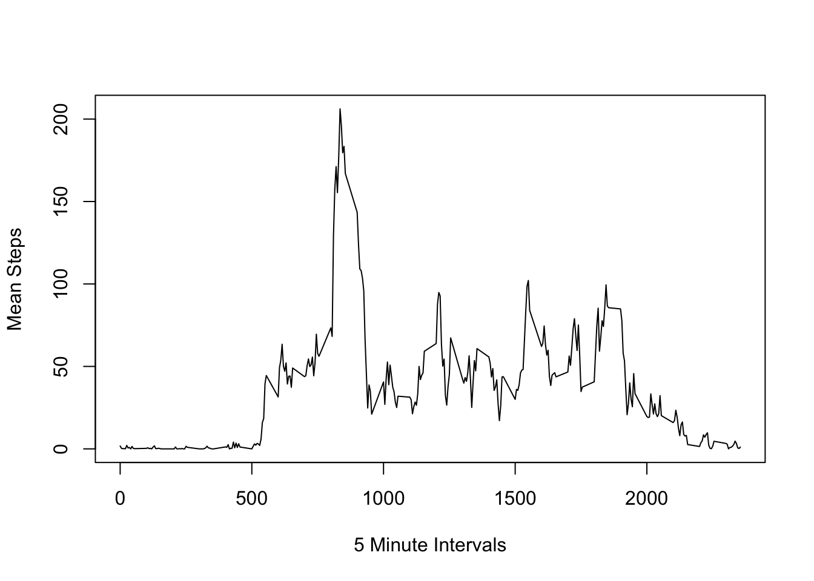
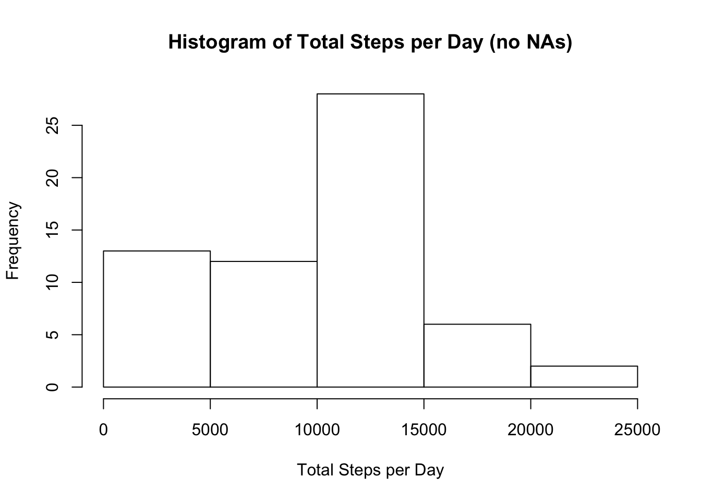
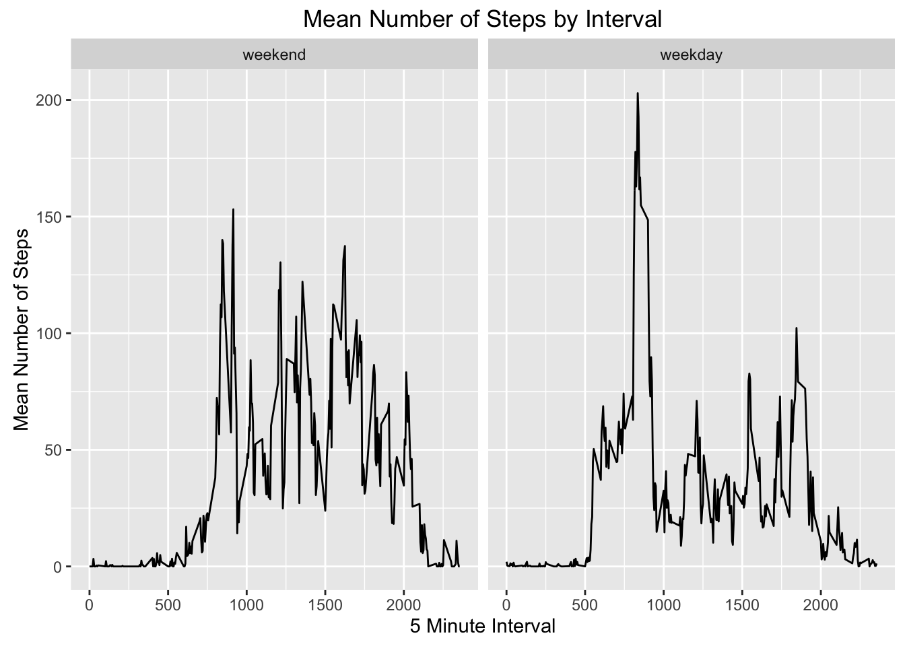

##Loading and preprocessing the data

Load the activity.csv data file (making sure the data is in the working directory).  
Change format of the date variable.


```r
activity<-read.csv("activity.csv")
activity$date<-as.Date(as.character(activity$date),"%Y-%m-%d")
```

##What is the mean total number of steps taken per day?

Calculate the total number of steps per day.


```r
totalstepsperday<-tapply(activity$steps,activity$date,sum)
```

Create a histogram of the total number of steps taken each day.

```r
hist(totalstepsperday,main="Histogram of Total Steps per Day",xlab="Total Steps per Day")
```



Calculate the mean and median total number of steps taken per day.


```r
meanstepstotal<-mean(totalstepsperday,na.rm=TRUE)
medianstepstotal<-median(totalstepsperday,na.rm=TRUE)
```

The mean steps per day is 1.0766189\times 10^{4} and the median is 10765.  

##What is the average daily activity pattern?

Calculate the average steps per 5 minute interval across all days and find the maximum value and its interval.


```r
mean5minute<-tapply(activity$steps,activity$interval,mean,na.rm=TRUE)
max5minute<-max(mean5minute)
max5minuteinterval<-names(which.max(mean5minute))
```
  
Plot the mean # of steps taken for each interval across all days.

```r
plot(names(mean5minute),mean5minute,type="l",xlab="5 Minute Intervals",ylab="Mean Steps")
```



The inteval with the maximum value of 206.1698113 is 835.

##Inputting missing values

Calculate the number of NAs and replace them with the mean value of that day for steps in a new data set. Where there are no values available for the full day, set to 0.


```r
library(plyr)
sum(is.na(activity$steps))
```

```
## [1] 2304
```

```r
meansbydate<-ddply(activity,.(date),summarize,mean=ave(steps,FUN=mean))
meansbydate[is.na(meansbydate)]<-0
activity2<-activity
activity2[is.na(activity$steps),]$steps<-meansbydate[is.na(activity$steps),]$mean
```

Re-calculate the total number of steps per day with no NAs.


```r
totalstepsperday2<-tapply(activity2$steps,activity2$date,sum)
```

Create a new histogram of the total number of steps taken each day.

```r
hist(totalstepsperday2,main="Histogram of Total Steps per Day (no NAs)",xlab="Total Steps per Day")
```



Re-calculate the mean and median total number of steps taken per day with no NAs.


```r
meanstepstotal2<-mean(totalstepsperday2)
medianstepstotal2<-median(totalstepsperday2)
```

The new mean steps per day is 9354.2295082 and the median is 1.0395\times 10^{4}.   

Having replaced the NAs with mean values for the day (or 0 if the whole day was NA), we see that there are more days of lesser activity and a lower mean / median than we had when overlooking NAs entirely.   

##Are there differences in activity patterns between weekdays and weekends?

Find the dates that correspond to the weekends and weekdays and calculate means per interval for each.


```r
activity2$day<-ifelse(grepl("Sunday|Saturday",weekdays(activity2$date),perl=TRUE),"weekend","weekday")
mean5minuteweekend<-data.frame(interval=unique(activity2$interval),mean=with(subset(activity2,day=="weekend"),tapply(steps,interval,mean)),day="weekend")
mean5minuteweekday<-data.frame(interval=unique(activity2$interval),mean=with(subset(activity2,day=="weekday"),tapply(steps,interval,mean)),day="weekday")
mean5minutecomparison<-rbind(mean5minuteweekend,mean5minuteweekday)
```
  
Plot panels comparing average number of steps taken for each interval on weekends vs. weekdays.


```r
library(ggplot2)
g<-ggplot(mean5minutecomparison,aes(interval,mean))
g+geom_line()+facet_grid(.~day)+labs(y="Mean Number of Steps",x="5 Minute Interval",title="Mean Number of Steps by Interval")
```


